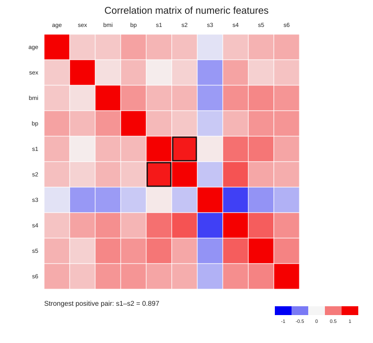
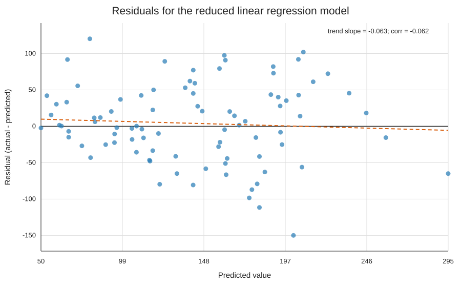

# ML-P-4 — сравнение наборов признаков

## Вариант B

Выполнено сравнение двух наборов признаков для линейной регрессии: baseline на всех числовых признаках и сокращённая модель после устранения мультиколлинеарности.

По умолчанию используется регрессионный датасет `Diabetes` из `scikit-learn`: 442 наблюдения, 10 числовых признаков (`age`, `sex`, `bmi`, `bp`, `s1`–`s6`) и цель `target`.

## Запуск

```bash
python3 -m venv .venv
source .venv/bin/activate       # Windows: .venv\\Scripts\\activate
pip install -r requirements.txt
python analysis.py
```

Можно подставить свой CSV:

```bash
python analysis.py --data path/to/data.csv --target target_column
```

## 1. Базовая модель

`LinearRegression` обучена на всех 10 числовых признаках. Разбиение одинаковое для обеих моделей: 80% train / 20% test, `random_state=42`.

| Модель | Признаков | R² | MAE | RMSE |
|---|---:|---:|---:|---:|
| Baseline | 10 | 0.4526 | **42.7941** | 53.8534 |
| После VIF-отбора | 9 | **0.4575** | 42.8709 | **53.6130** |

## 2. Мультиколлинеарность

Корреляционная матрица показывает сильную связь `s1` и `s2`: `r ≈ 0.897`.

Начальные VIF:

| feature | VIF |
|---|---:|
| s1 | **59.203** |
| s2 | **39.193** |
| s3 | **15.402** |
| s5 | **10.076** |
| s4 | 8.891 |
| bmi | 1.509 |
| s6 | 1.485 |
| bp | 1.459 |
| sex | 1.278 |
| age | 1.217 |

Использован итеративный VIF-отбор с порогом 10. Признак с максимальным VIF удаляется, после чего VIF пересчитывается. Был удалён `s1`. После этого максимальный VIF стал `7.819`, то есть ниже порога.

Финальный набор признаков:

```text
age, sex, bmi, bp, s2, s3, s4, s5, s6
```



## 3. Сравнение моделей

После удаления `s1`:

- `R²` вырос с `0.4526` до `0.4575`;
- `RMSE` снизился с `53.8534` до `53.6130`;
- `MAE` изменился лишь примерно на `0.08` в худшую сторону;
- число признаков уменьшилось с 10 до 9;
- выраженная мультиколлинеарность устранена.

Поэтому сокращённая модель предпочтительнее: она проще и устойчивее, при этом качество прогноза не ухудшается.

## 4. Остатки



Для сокращённой модели:

- наклон линейного тренда остатков: `-0.0626`;
- корреляция между прогнозом и остатком: `-0.0619`.

Точки в основном расположены вокруг нулевой линии, тренд почти горизонтален, а корреляция близка к нулю. **Выраженного систематического паттерна в остатках не видно**, поэтому график не указывает на сильное нарушение предположения о линейной форме зависимости.

## 5. Итоговый вывод

Финальной выбрана **линейная регрессия на 9 признаках без `s1`**. Причина: `s1` имел очень высокий VIF (`≈59.2`) и был сильно связан с `s2`. После его удаления максимальный VIF падает ниже 10, `R²` слегка растёт, `RMSE` слегка уменьшается, а остатки не показывают заметного систематического рисунка.

## Результаты

В папке `results/` сохранены:

- `metrics.csv` — метрики baseline и сокращённой модели;
- `vif_initial.csv`, `vif_final.csv` — VIF до и после отбора;
- `correlation_matrix.csv`, `correlation_matrix.svg` — корреляции;
- `residuals.svg` — график остатков;
- `final_coefficients.csv` — коэффициенты финальной модели;
- `summary.json` — итоговые признаки и численная диагностика остатков.
